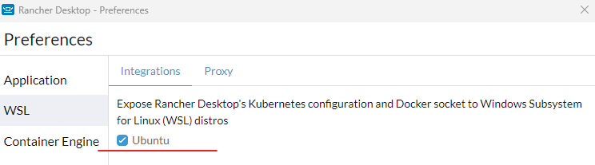
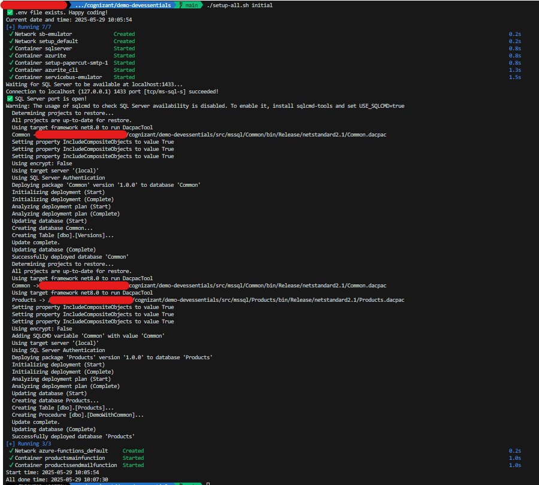
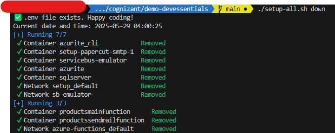

# Local dev environment with Azure emulated resources

A basic procedure to setup the local computer for development on projects that require Azure Blob storage and Azure Service Bus.
It relies on local emulators for Azure services:
- Azurite 
- Azure Service Bus emulator

## Table of Contents

- [Local dev environment with Azure emulated resources](#local-dev-environment-with-azure-emulated-resources)
  - [Table of Contents](#table-of-contents)
  - [Prerequisites](#prerequisites)
    - [Windows Subsystem for Linux (WSL)](#windows-subsystem-for-linux-wsl)
    - [Container management](#container-management)
      - [Rancher Desktop](#rancher-desktop)
    - [Microsoft Azure Storage Explorer](#microsoft-azure-storage-explorer)
    - [dotnet](#dotnet)
    - [Sql Server Management Studio (optional)](#sql-server-management-studio-optional)
    - [sqlcmd (optional)](#sqlcmd-optional)
  - [Configure the enviroment variables](#configure-the-enviroment-variables)
  - [One click local setup](#one-click-local-setup)
    - [Grant execute permissions](#grant-execute-permissions)
    - [Initial setup](#initial-setup)
    - [Down setup](#down-setup)
    - [Up setup](#up-setup)
  - [Workshop](#workshop)
    - [Workflow presentation](#workflow-presentation)
      - [VS Code Containers extension](#vs-code-containers-extension)
    - [Demo Steps](#demo-steps)
    - [Utils](#utils)
      - [Verify the topic content](#verify-the-topic-content)

## Prerequisites

The scripts require any of:
- WSL on Windows
- Linux
- MacOs

### Windows Subsystem for Linux (WSL)

[installation how-to](https://learn.microsoft.com/en-us/windows/wsl/install)

### Container management

Multiple options: Docker Desktop, Rancher Desktop, Podman

Depending on your budget choose one:

- [Docker Desktop (license needed, paid)](https://www.docker.com/get-started/)
- [Rancher Desktop (open source, free)](https://rancherdesktop.io/)

#### Rancher Desktop

Note: On Windows be assurred that the WSL option is checked



### Microsoft Azure Storage Explorer

- [Download](https://azure.microsoft.com/en-us/products/storage/storage-explorer/?msockid=33c94a40e45764c00a6b5f96e5ad6567#Download-4)

### dotnet 

- [dotnet-sdk](https://dotnet.microsoft.com/en-us/download/dotnet/9.0) 9.0 or later
- [MSBuild.Sdk.SqlProj](https://github.com/rr-wfm/MSBuild.Sdk.SqlProj)

### Sql Server Management Studio (optional)

- [ssms install](https://learn.microsoft.com/en-us/ssms/install/install)

### sqlcmd (optional)

```bash
curl https://packages.microsoft.com/keys/microsoft.asc | sudo apt-key add -
curl https://packages.microsoft.com/config/ubuntu/$(lsb_release -rs)/prod.list | sudo tee /etc/apt/sources.list.d/msprod.list

sudo apt-get update
sudo apt-get install mssql-tools unixodbc-dev

echo 'export PATH="$PATH:/opt/mssql-tools/bin"' >> ~/.bashrc
source ~/.bashrc
```

## Configure the enviroment variables

In the project root folder based on .env.example create the .env files as copy and modify the variable values of your choice;  
Check that the "Select End of Line Sequence: is set to LF (not CRLF).  
This settings can be changed in VSCode on right-bottom side.

```bash
cp .env.example .env
```

## One click local setup

The setup-all.sh has the follwing switches:

- debug - print the main environment variables
- initial 
  - pull the required containers and instantiate them
  - init the databases and seed them  - 
- up - turn up the containers
- down - turn down the containers

### Grant execute permissions

```bash
chmod +x setup-all.sh
```

### Initial setup

Create the containerized environment for emulators  
Update the database with latest changes  
Build the azure functions containers and start them

```bash
./setup-all.sh initial
```


  
### Down setup

```bash
./setup-all.sh down
```



### Up setup

```bash
./setup-all.sh up
```

  

## Workshop

The workshop presents an imaginary project that handles the processing for text files uploaded to Azure Blob Storage.
The workflow starts with a text file upload and it ends with storing the content of the file in SQL Server database and an email notification. 

### Workflow presentation


#### VS Code Containers extension

Present VS Code Containers extension:
- Containers
- Images
- Registry
- Logs
- Shell

### Demo Steps

1. Edit  demo-data/a1.txt with "new content"
2. Open Microsoft Azure Storage Explorer
3. Upload demo-data/a1.txt to blob container product-samples
4. Present the workflow trace
   1. Containers logs
   2. Sql server database
      1. Message decoding from [SbMessageContainerDatabase00001].[dbo].[BodiesTable]
      2. Message insertion in [Products].[dbo].[Products] table

### Utils

#### Verify the topic content

```sql
SELECT TOP (1000) [EntityGroupId]
      ,[EntityId]
      ,[SequenceNumber]
      ,[SubqueueType]
      ,[Headers]
      ,[Body]
      ,[HeaderSize]
      ,[BodySize]
      ,[AcknowledgedByTopic]
      ,[InsertVersion]
      ,[UpdateVersion]
      ,[State]
      ,[CreatedTime]
      ,[LastUpdatedTime]
  FROM [SbMessageContainerDatabase00001].[dbo].[BodiesTable]
  ```

