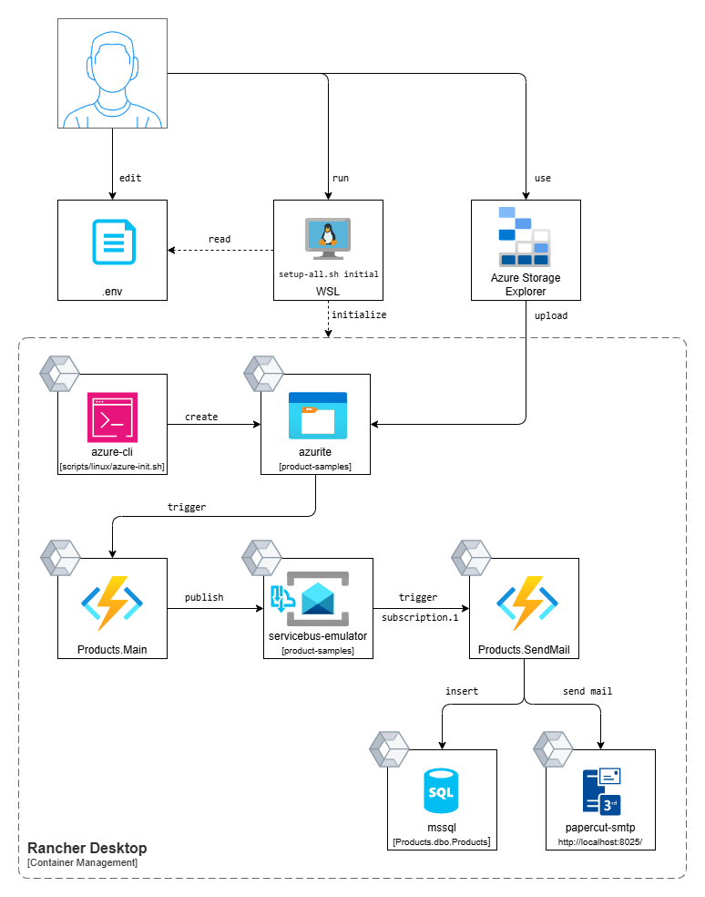

# Azure functions workshop demo

Local setup with azurite and Azure Service Bus emulator

## Prerequisites

### Docker or Rancher

- [Docker](https://www.docker.com/get-started/)
- [Rancher Desktop](https://rancherdesktop.io/)

### dotnet sdk

- [dotnet-sdk](https://dotnet.microsoft.com/en-us/download/dotnet/9.0) 9.0 or later

### sqlcmd (optional)

```bash
curl https://packages.microsoft.com/keys/microsoft.asc | sudo apt-key add -
curl https://packages.microsoft.com/config/ubuntu/$(lsb_release -rs)/prod.list | sudo tee /etc/apt/sources.list.d/msprod.list

sudo apt-get update
sudo apt-get install mssql-tools unixodbc-dev

echo 'export PATH="$PATH:/opt/mssql-tools/bin"' >> ~/.bashrc
source ~/.bashrc
```

## Workshop

### Workflow presentation




### Verify the topic content

```sql
SELECT TOP (1000) [EntityGroupId]
      ,[EntityId]
      ,[SequenceNumber]
      ,[SubqueueType]
      ,[Headers]
      ,[Body]
      ,[HeaderSize]
      ,[BodySize]
      ,[AcknowledgedByTopic]
      ,[InsertVersion]
      ,[UpdateVersion]
      ,[State]
      ,[CreatedTime]
      ,[LastUpdatedTime]
  FROM [SbMessageContainerDatabase00001].[dbo].[BodiesTable]
  ```